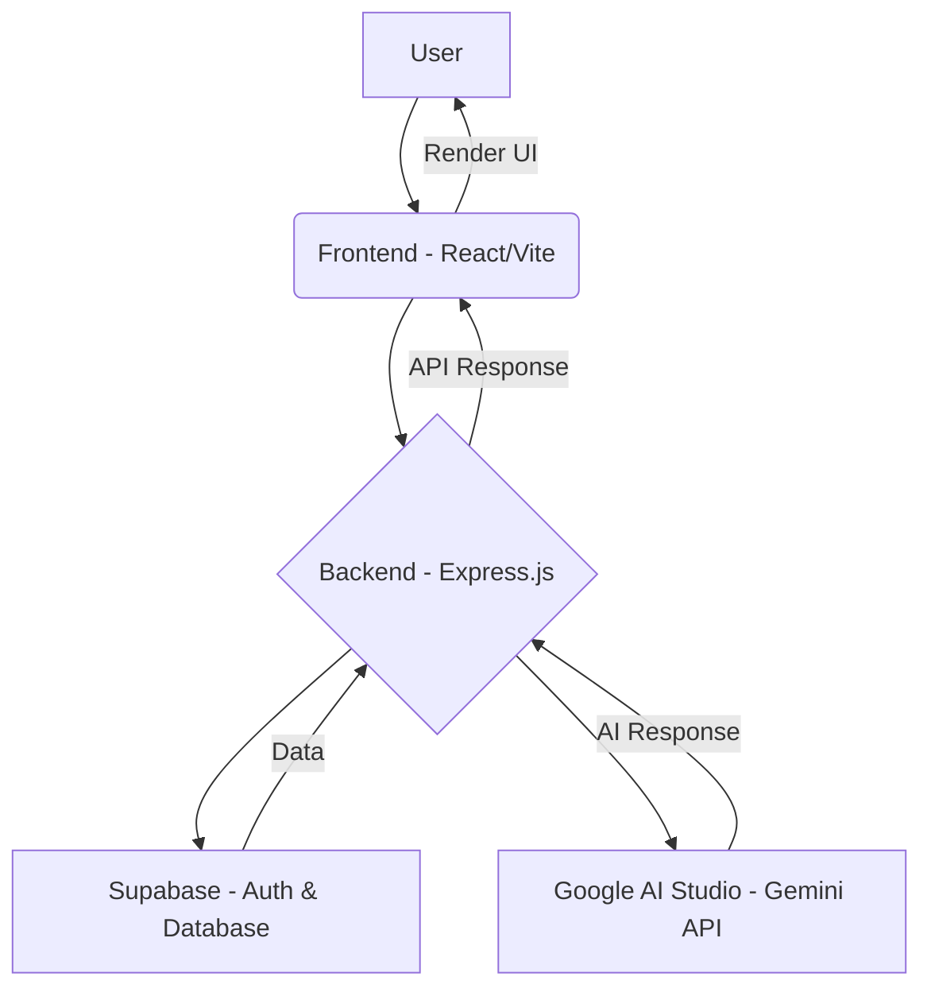

# 🔥 HealthNav

**Your AI-powered health companion for a safer, healthier life.**

 
 
 


## 📌 About the Project

HealthNav is an innovative AI-powered healthcare application designed to act as your personal health guardian. It leverages cutting-edge AI to provide personalized, safe, and accurate health-related insights, helping users make informed decisions about their well-being. HealthNav aims to solve the problem of information overload and misinformation in healthcare by offering a reliable and intelligent platform for managing personal health.

### Problem it solves

In today's digital age, accessing accurate and personalized health information can be challenging. Users often face conflicting advice, complex medical jargon, and a lack of context-specific guidance. HealthNav addresses these issues by providing a centralized, intelligent system that understands individual health profiles and delivers tailored recommendations, safety checks, and actionable insights.

### Why it matters

HealthNav empowers users to take proactive control of their health. By offering features like medicine analysis, drug interaction checks, pediatric dosage calculations, pregnancy safety assessments, vaccination tracking, diet planning, symptom checking, and lab report analysis, it significantly enhances personal medical safety and promotes healthier lifestyles. Its emergency response capabilities ensure critical alerts are delivered when they matter most, potentially saving lives.

## 🧰 Tech Stack

| Category   | Technology       | Description                                    |
| :--------- | :--------------- | :--------------------------------------------- |
| Frontend   | React / Vite     | Fast, modern web development with a great DX.  |
| Backend    | Supabase         | Auth, Database, and Realtime functionalities.  |
| AI         | Google AI Studio | Powers intelligent health analysis (Gemini API). |
| Deployment | Vercel           | Seamless, scalable hosting for the application. |

## 🚀 Live Demo

Experience HealthNav live: [https://healthnav.vercel.app/](https://healthnav.vercel.app/)

## ✨ Features

*   💊 **Medicine Analysis**: Identify medicines, check compatibility with your profile, and detect overdose risks, pregnancy safety, and allergy conflicts.
*   🤝 **Drug Interaction Check**: Analyze multiple medicines for dangerous combinations and receive clear warnings.
*   👶 **Pediatric Dosage**: Calculate safe dosages for children based on weight.
*   🤰 **Pregnancy Safety**: Assess medicine safety during pregnancy and get trimester-specific advice.
*   💉 **Vaccination System**: Suggest vaccines based on age/pregnancy and track your vaccination status.
*   🍎 **Diet Planner**: Generate personalized diet plans based on your health conditions and age.
*   🔍 **Symptom Checker**: Analyze symptoms, suggest possible conditions, and provide urgency levels.
*   🔬 **Lab Report Analysis**: Interpret lab reports, highlight abnormal values, and provide insights.
*   🚨 **Emergency Response**: Critical alerts and guidance for severe symptoms, including emergency service contact.

## ⚙️ Getting Started

To get a local copy up and running, follow these simple steps.

### Prerequisites

*   Node.js (v18 or higher)
*   npm or yarn
*   Git
*   A Supabase account
*   A Google AI Studio API Key

### Installation steps

1.  **Clone the repository**

    ```bash
    git clone https://github.com/Kathir-star/HealthNav.git
    cd HealthNav
    ```

2.  **Install dependencies**

    ```bash
    npm install
    # or
    yarn install
    ```

### Environment setup

1.  **Create a `.env` file** in the root of the project based on `.env.example`.

    ```
    VITE_SUPABASE_URL="YOUR_SUPABASE_URL"
    VITE_SUPABASE_ANON_KEY="YOUR_SUPABASE_ANON_KEY"
    GEMINI_API_KEY="YOUR_GOOGLE_GEMINI_API_KEY"
    ```

2.  **Configure Supabase**: Set up your Supabase project with the schema provided in `supabase_schema.sql`.

### Running locally

```bash
npm run dev
# or
yarn dev
```

This will start the development server, usually at `http://localhost:3000`.

## 🧠 Project Architecture



**Flow Description:**

1.  **User Interaction**: The user interacts with the HealthNav application through the **Frontend** (built with React/Vite).
2.  **Frontend to Backend**: User requests (e.g., chat messages, data queries) are sent from the Frontend to the **Backend** (an Express.js server).
3.  **Backend Processing**: The Backend acts as an orchestrator:
    *   It communicates with **Supabase** for user authentication, database operations (e.g., fetching health profiles, saving conversations), and real-time updates.
    *   It integrates with **Google AI Studio (Gemini API)** to process AI-powered requests like medicine analysis, symptom checking, and diet planning.
4.  **Data & AI Responses**: Supabase provides necessary data to the Backend, and the Gemini API returns AI-generated insights.
5.  **Backend to Frontend**: The Backend processes these responses and sends them back to the Frontend.
6.  **UI Rendering**: The Frontend then renders the updated user interface with the received information.

## 👥 Team Members

*   [jafferrilwaan-png](https://github.com/jafferrilwaan-png)
*   [Kathir-star](https://github.com/Kathir-star)
*   [Giridhar-4](https://github.com/Giridhar-4)
*   [s-inbarasan](https://github.com/s-inbarasan)

## 📜 License

This project is licensed under the MIT License - see the [LICENSE](LICENSE) file for details.
