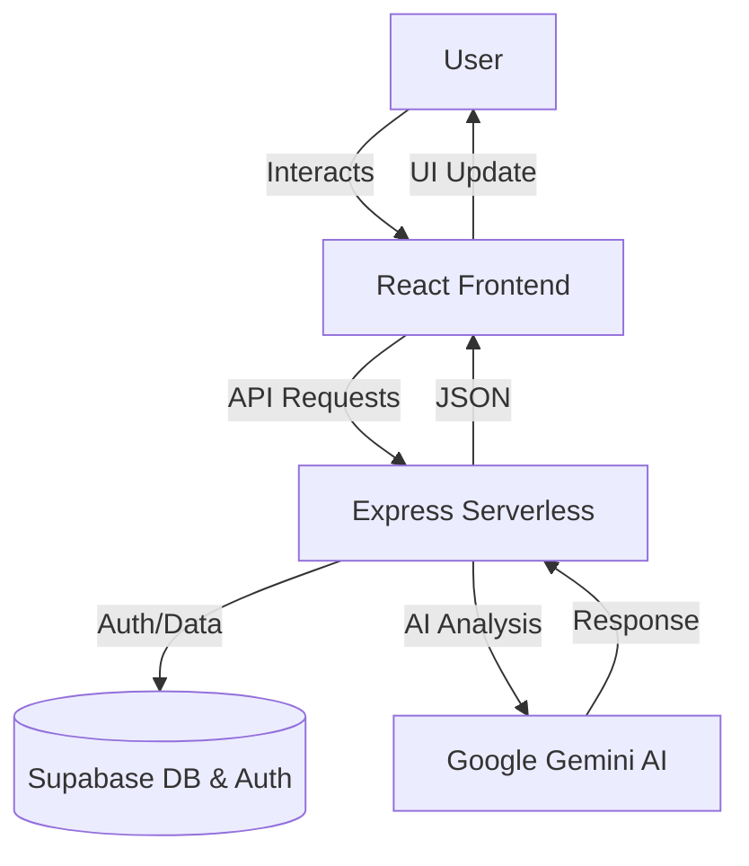

# 🏥 HealthNav | AI-Powered Medical Companion

[](https://healthnav.vercel.app/)
[](https://reactjs.org/)
[](https://supabase.com/)
[](https://tailwindcss.com/)
[](https://ai.google.dev/)

**HealthNav** is your intelligent health guardian, designed to provide safe, personalized, and accurate medical insights. Powered by Google's Gemini AI and built with a robust React + Supabase stack, HealthNav helps you navigate your health journey with confidence.

---

## 🚀 Key Features

- **🧠 Airi AI Assistant**: Real-time medical guidance and symptom analysis.
- **💊 Medicine Scanner**: Identify medications and check for safety, dosage, and interactions.
- **📊 Vitals Tracking**: Monitor your health metrics with an intuitive dashboard.
- **🏥 Hospital Finder**: Locate nearby medical facilities based on your symptoms.
- **🩸 Donor Network**: Connect with blood and organ donors in your community.
- **🛡️ Privacy First**: Secure authentication and data management via Supabase.

---

## 🛠️ Tech Stack

- **Frontend**: React 19, TypeScript, Vite, Tailwind CSS
- **Backend**: Node.js (Express) on Vercel Serverless
- **Database & Auth**: Supabase
- **AI Integration**: Google Gemini 1.5 Flash
- **Animations**: Framer Motion (Motion)

---

## 🏗️ Project Architecture



---

## 📦 Project Structure

```text
/
├── public/                # Static assets
├── src/                   # Source code
│   ├── assets/            # Project-specific assets
│   ├── components/        # Reusable UI components
│   ├── config/            # Configuration (Supabase, etc.)
│   ├── hooks/             # Custom React hooks
│   ├── pages/             # Page-level components
│   ├── services/          # API & External service logic
│   ├── styles/            # Global styles
│   ├── utils/             # Helper functions
│   ├── App.tsx            # Main application entry
│   └── server.ts          # Backend API logic
├── index.html             # Entry HTML
├── vercel.json            # Vercel deployment config
└── package.json           # Dependencies & scripts
```

---

## ⚙️ Getting Started

### Prerequisites
- Node.js (v18+)
- npm or pnpm

### Installation
1. **Clone the repository**:
   ```bash
   git clone https://github.com/Kathir-star/HealthNav.git
   cd HealthNav
   ```

2. **Install dependencies**:
   ```bash
   npm install
   ```

3. **Environment Variables**:
   Create a `.env` file in the root and add:
   ```env
   VITE_SUPABASE_URL=your_supabase_url
   VITE_SUPABASE_ANON_KEY=your_supabase_anon_key
   GEMINI_API_KEY=your_gemini_api_key
   ```

4. **Run Development Server**:
   ```bash
   npm run dev
   ```

---

## 👥 Team Members

- [Jafferrilwaan](https://github.com/jafferrilwaan-png)
- [Kathir-star](https://github.com/Kathir-star)
- [Giridhar-4](https://github.com/Giridhar-4)
- [Inbarasan](https://github.com/s-inbarasan)

---

## 📜 License

This project is licensed under the **MIT License**. See the [LICENSE](LICENSE) file for details.

---

*Disclaimer: HealthNav is an AI-powered tool and should not replace professional medical advice. Always consult with a qualified healthcare provider for medical concerns.*
